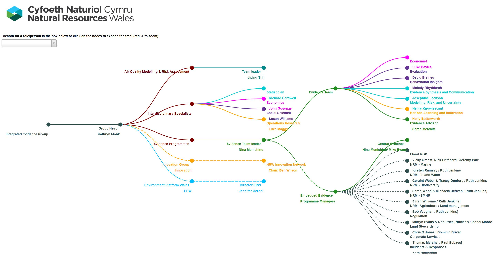

# integratedevidenceteam

## Interactive demonstration of the Integrated Evidence Team
### Built using D3 and an expanding tree concept (adapted from some mbostock blocks)

### Click on nodes to expand the tree
### if you know the staff name you can search in the box

#### colours illustrate the matrix management team structure 
#### dotted linkages represent the cross organisational links
#### fully expanded example below 
